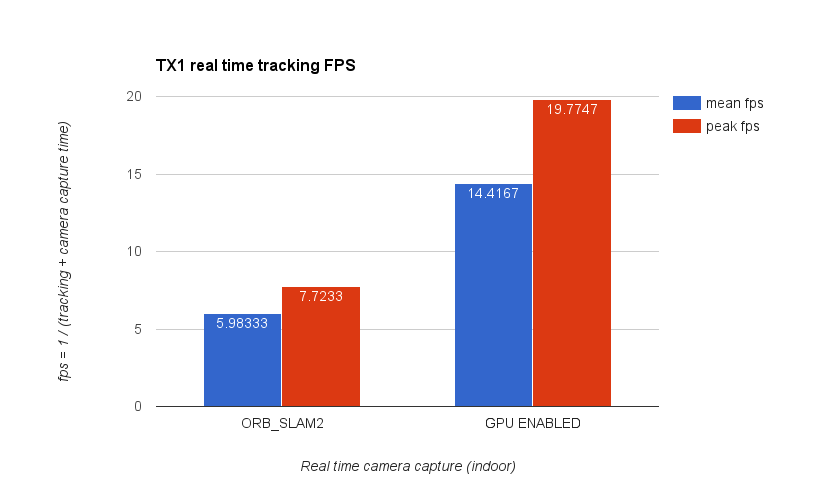
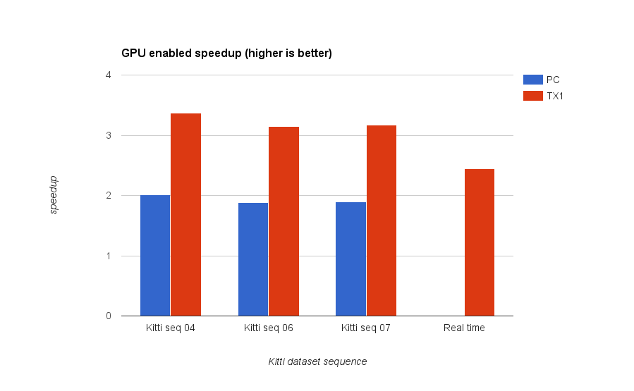

# ORB-SLAM2 GPU optimization
## GPUGPU 2016 Final Project

### Introduction

### Video

### Abstract
Enable GPU optimizations to achieve real time SLAM on the Jetson TX1 embedded computer.

### Optimization detail

##### Switch from OpenCV 2.4 to OpenCV 3.1
OpenCV 3.1 introduces several features helpful to this project: custom memory allocator, 
Cuda stream and rewrite of some essential algorithms, such as Fast and ORB.
These features allow us to fully exploit more Cuda APIs, such as Unified Memory.

##### Feature extraction reimplemented
In the original implementation of `ORB_SLAM2` there are several execution hotspots in the feature
detection and extraction algorithms. Those including but not limited to `FAST corner detection`,
`Gaussian filter` and `ORB feature extraction`.

In `ORB_SLAM2`'s implementation, an image is divided into many small tiles and `FAST` is invoked on each
tile one or two times in order to achieve high accuracy. The algorithm was effective but not efficient.
Hence we implemented a slightly modified version of the above algorithm in CUDA and parallelized the work
of each tile.

We used openCV's CUDA enabled Gaussian filter and moved the work from CPU to GPU.

`ORB feature extraction` is also a costly but parallelizable procedure, so it's implemented with CUDA, too.

##### Overlap CPU and GPU execution
However, there are still some irregular code segments that cannot be parallelized. So our next goal is to 
maximize the overlap of CPU and GPU work. Ideally if a CPU work is completed before a GPU kernel ends then
the CPU work would be "free", but many CPU work have data dependencies on other GPU results, so the CPU / GPU
work scheduling has to be done wisely.
With the help of many profiles (thanks to NVVP), we've figured out a pretty good scheduling scheme
to pipeline CPU and GPU work. The result is that GPU is kept as busy as possible while CPU can overlap many
of it's execution time with GPU.

The purple bars on the row "Default domain" indicates CPU work and the "Compute" row indicates GPU work.

##### Results
Following are some charts of the speedups we achieved on an ordinary PC and on a jetson TX1.
The PC's CPU / GPU is Xeon E3 1231 / GTX 760.
The statistics were mesured using chosen sequences of the KITTI dataset and live captured images from the 
camera module on top of TX1.

After enabling GPU optimization, the fps of live camera tracking is increased from 5.98 to 14.42 and frame 
processing time is reduced from 0.166s to 0.068s !

##### Compute Fast with GPU
The `cv::FAST` function is the main bottleneck in the original implementation.  It is invoked in
every grid of every level of pyramid of every frame to extract their keypoints.  The cost is doubled
if the given grid is of low contrast and `cv::FAST` has to be invoked once more with a lower threshold.
We reduce the inner level of every level by extracting keypoints of entire frame in one GPU kernel.  In
addition, we enhance data locality by including the low-contrast fallback in the same kernel.

##### Software Pipelining
We use Cuda stream to asynchronously copy memory & launch kernel to hide their latencies, respectively.
In addition, kernel of subsequent level is launched asynchronously right after current level, achieving
the pipelining effect analogous to that of hardware.  The technique is used in both extracting
FAST keypoints and computing ORB descriptors.

##### Unified Memory
We use Cuda Unified Memory, exploiting the unique unified physical memory of Nvidia Tegra, to save host-device
memory copy.

##### Save memory allocation/free
In the original implementation, some frequently invoked functions locally allocate/free memory in every invocation.
We save such overhead by allocating memory once and free it when it will no longer be used.

##### Transform still more procedures into GPU
Functions such as `resize`, `copyMakeBorder`, `Gaussian filter` are directly replaced by the their GPU counterparts
in OpenCV.  Functions such as `compute_IC_Angle`, `compute_ORB_Descriptor` are adopted from OpenCV's
implementation to fit our needs.
